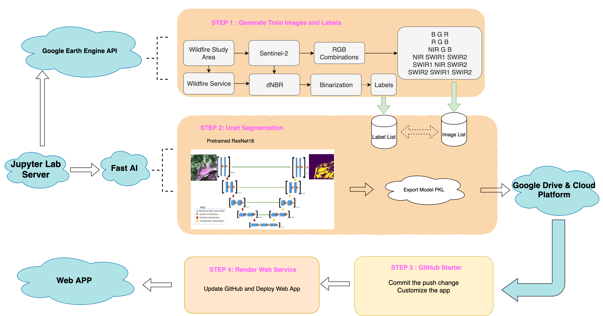
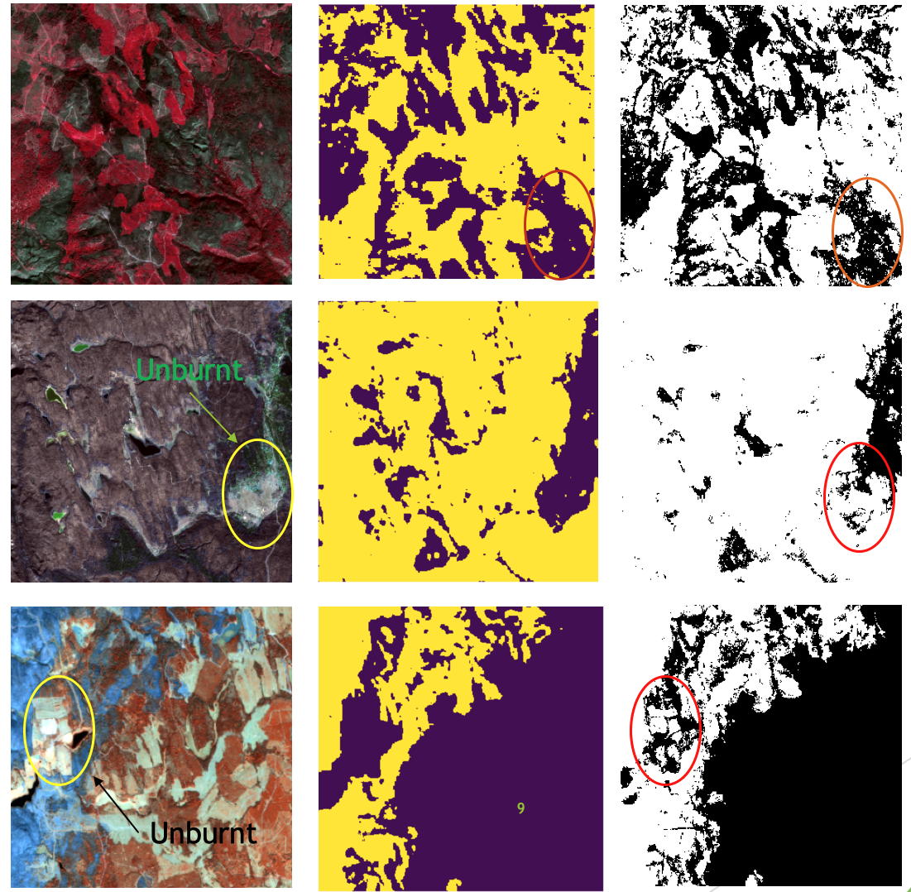

# Starter for deploying [F2S model](https://f2s.onrender.com) on Render

## Introduction:

Semantic Segmentation Platform on Forest Wildfire

Proposed Forest Fire to Semantic Segmentation (F2S) Platform is a cloud artificial intelligence solution for high-volume satellite data in forest wildfire detection. F2S shall provide easy to use high resolution burnt area calculations and visualizations to professionals within forestry and insurance. The current F2S functional prototype is based on optical satellite data, but a model for radar-based satellite data is being developed.

Available technologies in forest wildfire detection include aircrafts, cameras, satellites and drones. Different platforms have different image formats based on the different wavelengths, which vice versa makes the universal cloud processing difficult, not to mention the multi-source fusion.
 
F2S would provide a rapid response platform for uploading ROI image and then analyzing the input source to get final burnt area information.

## Workflow:

### Step1: 
we apply Google Earth Engine Python API to generate the train images and labels.  After confirming the region of interest, we could get the available Sentinel-2 images in a specific day during the fire or after the fire. Through the batch-downloading algorithm developed by us, it becomes every easy to generate the Geotiff or PNG format images including any bands we want. About the labels, we use the delta normalized burnt ratio to threshold the burnt area and then constrain it  within the released  official burnt region by authorities. Usually, the large wildfire would make the Sentinel-2 image huge volume. To speed the train process, we clip the ROI which contains burnt and unburnt into 300*300 pixels. The pixel resolution is 20 meters same with Sentinel-2. 

### Step2: 
The fastai library simplifies training fast and accurate neural nets using modern best practices.  We download the pre-trained resnet18 model and then apply the dynamic Unet architecture to train the semantic segmentation. Finally we could export the model as pkl file and then it will be uploaded into Google Drive. Since it is bigger than 100 Megabytes. We also need the google cloud platform to help generate downloaded link. 

### Step 3 
is to customize the web app based on GitHub Starter specific for fastai model. And then the app will be connected with the Deployment tool Render web service which will watch the updates in GitHub.

All the processing is finished in cloud platform. [ESDL cloud server](https://www.earthsystemdatalab.net/) supports the computation of Step 1 and 2. Cloud Web Service and GitHub makes the web deployment successful. 

* GEE download algorithm can be found in the repostory [GEE_batch_download] (https://github.com/KuntaHu/GEE_batch_download)
* Unet Implementation can be found in the repostory [Unet_Burnt_Area_Semantic_Seg] (https://github.com/KuntaHu/Unet_Burnt_Area_Semantic_Seg)
* The model could be downloaded in server.py
* test images could be downloaded in Test_images folder

## Results

### Data Generation

### Results

## Conclusion
1. F2S has good performance especially in true-color image segmentation.
2. F2S outperforms the detection results even the original labels produced by traditional dNBR with high accuracy and low noise.
3. F2S platform learns the relationship between burnt pixels and adjacent pixels which makes its results explicable since wildfire usually has a continuous progression rather than random fire ignition pixels. 
4. F2S model could learn the representation of different combinations of optical bands which will be much more robust and general than traditional segmentation based RGB. 
5. Trained model contains the advantages of all fire-sensitive bands, which could filter the unburnt pixel with abnormal reflectance in specific bands.

